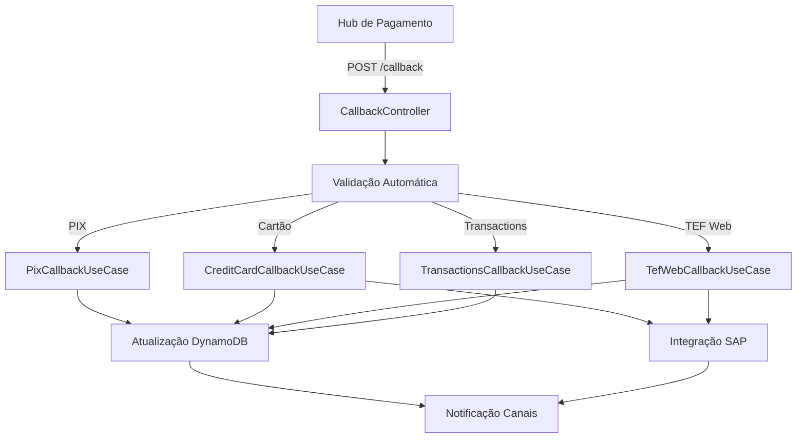

# OMP Hub Payment Callback Microservice

Microserviço especializado no processamento de callbacks de pagamento dos diferentes hubs de pagamento e encaminhamento para os canais apropriados.

## Visão Geral

Este microserviço foi extraído do `omp-hub-payment-journey-ms` para isolar e especializar o processamento de callbacks de pagamento, oferecendo:

- Processamento de callbacks PIX
- Processamento de callbacks de Cartão de Crédito  
- Processamento de callbacks TEF Web
- Processamento de callbacks de Transactions
- Integração com sistemas SAP (Payments e Redemptions)
- Notificações para canais de origem
- Validação automática de tipos de callback

## Stack Tecnológica

- **Java 17**
- **Spring Boot 3.5.0**
- **Spring Data**
- **AWS SDK** (DynamoDB, Parameter Store)
- **OkHttp** para comunicação HTTP
- **SpringDoc OpenAPI** para documentação
- **Lombok** para redução de código boilerplate
- **Jackson** para serialização JSON

## Arquitetura

O projeto segue a **Arquitetura Hexagonal (Ports & Adapters)**:

```
src/main/java/com/omp/hub/callback/
├── PaymentCallbackApplication.java          # Classe principal
├── application/
│   ├── controller/
│   │   ├── CallbackController.java             # Controller principal
│   │   └── HealthCheckController.java          # Health check
│   ├── usecase/callback/                       # Use cases de callback
│   │   ├── PixCallbackUseCase.java
│   │   ├── CreditCardCallbackUseCase.java
│   │   ├── TefWebCallbackUseCase.java
│   │   └── TransactionsCallbackUseCase.java
│   └── utils/                                  # Utilitários
├── domain/
│   ├── model/dto/                              # DTOs por domínio
│   ├── service/                                # Interfaces de serviços
│   ├── ports/                                  # Contratos de integração
│   ├── enums/                                  # Enumerações
│   └── exceptions/                             # Exceções de negócio
└── infrastructure/
    ├── client/                                 # Clientes HTTP
    ├── config/                                 # Configurações
    └── persistence/                            # Implementações de persistência
```

## Endpoints

### Callback Principal

```http
POST /omphub/callback/callback
Content-Type: application/json
```

Processa automaticamente callbacks dos tipos:
- `PixCallbackRequest`
- `CreditCardCallbackRequest` 
- `TefWebCallbackRequest`
- `TransactionsRequest`

### Monitoramento

```http
GET /actuator/health           # Health check
GET /swagger-ui.html          # Documentação Swagger
GET /api-docs                 # Especificação OpenAPI
```

## Configuração

### Profiles de Ambiente

| Profile | Arquivo | Descrição |
|---------|---------|-----------|
| `local` | `application-local.yml` | Desenvolvimento local |
| `dev` | `application-dev.yml` | Desenvolvimento |
| `hom` | `application-hom.yml` | Homologação |
| `prod` | `application-prod.yml` | Produção |

### Dependências AWS

- **DynamoDB**: Persistência de dados de pagamento
- **Parameter Store**: Configurações e credenciais

### Integrações

- **SAP Payments**: Processamento de pagamentos
- **SAP Redemptions**: Processamento de resgates  
- **Transactions Notifications**: Notificações de transações
- **Apigee Gateway**: Autenticação e roteamento

## Execução

### Requisitos

- Java 17+
- Maven 3.6+
- Acesso AWS configurado

### Comandos Maven

```bash
# Compilação
./mvnw clean compile

# Execução local
./mvnw spring-boot:run -Dspring-boot.run.profiles=local

# Execução em desenvolvimento
./mvnw spring-boot.run.profiles=dev

# Testes
./mvnw test

# Verificação de saúde
curl http://localhost:8090/actuator/health
```

### Docker

```bash
# Build
docker build -t omp-hub-payment-callback-ms .

# Execução
docker run -p 8090:8090 \
  -e SPRING_PROFILES_ACTIVE=local \
  omp-hub-payment-callback-ms
```

## Fluxo de Processamento



### Processamento Detalhado

1. **Recepção**: Hub envia callback via HTTP POST
2. **Validação**: Identificação automática do tipo de callback
3. **Processamento**: Execução do use case específico
4. **Persistência**: Atualização de status no DynamoDB
5. **Integração**: Comunicação com SAP quando necessário
6. **Notificação**: Envio para canais de origem

## Testes

```bash
# Todos os testes
./mvnw test

# Relatório de cobertura
./mvnw test jacoco:report

# Testes unitários
./mvnw test -Dtest="*Test"

# Testes de integração  
./mvnw test -Dtest="*IT"
```

## Monitoramento e Logs

### Métricas

- Health checks via Spring Actuator
- Logs estruturados por nível
- Rastreamento de requests
- Métricas de performance

### Comandos de Log

```bash
# Acompanhamento em tempo real
tail -f logs/application.log

# Filtros específicos
grep "CallbackController" logs/application.log
grep "ERROR" logs/application.log
```

## Solução de Problemas

### Problemas Comuns

**Erro de Autenticação Apigee**
- Verificar header `x-client-auth` nas configurações
- Validar token de acesso no Parameter Store

**Falha na Comunicação SAP**
- Confirmar conectividade de rede
- Verificar credenciais e URLs de endpoint

**Erro de Parsing JSON**
- Validar estrutura do payload de entrada
- Verificar logs de resposta do Apigee

### Logs de Debug

Para habilitar logs detalhados, adicionar no `application.yml`:

```yaml
logging:
  level:
    com.omp.hub.callback: DEBUG
    org.springframework.web: DEBUG
```
